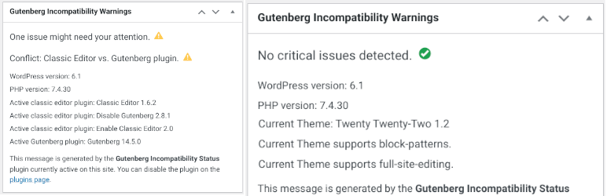

# Show Block / Full-Site Editing Incompatibility Status in WP-Admin

[Incompatibility Status](https://wordpress.org/plugins/incompatibility-status/)  adds a status message to the admin dashboard to display possible incompatibility issues using the block editor and full-site editing.

This plugin checks for possible mismatching setups and displays a status in the admin dashboard. Currently checks if a WordPress instance has an active classic editor plugin while using a block theme as the current theme. It also checks and displays the current PHP version. We will check full-site editing vs. incompatible popular plugins in the future.



## Usage

The incompatibility status widget can be used for existing WordPress sites and for local setups like [wp_cli_docker](https://github.com/openmindculture/wp_cli_docker). Both tools aim to provide a quick and easy way to ensure compatibility of WordPress core versions, plugins, themes, and server configurations (PHP version etc.) to prevent fatal errors after updating production sites.

## Development

Follow the [detailled WordPress plugin development guidelines](https://developer.wordpress.org/plugins/wordpress-org/detailed-plugin-guidelines/).

In JetBrains IDEA (PhpStorm, WebStorm, etc.) enable WordPress support and set `wp_data` as WordPress path, so that the local code inspections like SonarLint can recognize the built-in functions. You can still mark the directory as excluded to avoid unnecessary indexing and search results.

Some SonarLint warnings (and PHP PSR conventions) should be ignored, like avoiding underscores in function names. As we operate in a global namespace shared with other plugins, it is considered best practice to use a unique prefix for identifiers used for `function`, `class`, and `define`.

A local code sniffer validation can be set up using the provided `composer.json` configuration. Note that this currently does not work with PHP 8, so you need to use a PHP 7.4 runtime (`/usr/bin/php74`). You may need to adjust the IDE settings to WordPress coding standards and code sniffer configurations according to the provided tutorial.

- https://packagist.org/packages/wp-coding-standards/wpcs
- https://www.jetbrains.com/help/idea/using-php-code-sniffer.html#installing-configuring-code-sniffer
- https://www.linuxbabe.com/ubuntu/php-multiple-versions-ubuntu

### SVN Release Tags

We use `git` branches and tags for feature development, and `svn` to release to the WordPress plugin directory. So all development is done in `incompatibility-status/trunk`!

To add svn tags, use the `svn` command or create a new symbolic link in the `tags` directory. [Symbolic links are stored as files in git.](https://stackoverflow.com/questions/954560/how-does-git-handle-symbolic-links) So we should not add `tags` to `.gitignore`, but we can mark it as an ignored / excluced directory in our IDE to make sure we only edit and search files our `trunk` directory.

```
cd incompatibility-status/tags
ln -s ../trunk 1.0.0
```

Replace `1.0.0` with the new release tag name.

### Verify the Plugin before committing

To verify the release, create an archive file of the tag directory, e.g.

```
cd incompatibility-status/tags
zip incompatibility-status-1.0.0.zip 1.0.0
```

The resulting zip archive file can be uploaded into an existing WordPress instance to verify that it works.

Commit the result to both repositories:

```
git commit -a
git push
git tag "1.0.0"
git push --tags
cd incompatibility-status
svn commit
```

#### Validate the readme file

Run `incompatibility-status/trunk/readme.txt` through the official [WordPress ReadMe Validator](https://wordpress.org/plugins/developers/readme-validator/). You’ll get notified if there is an error in your file.

### Tag Versions in Git vs. SVN

Development milestones that do not correspond to official releases, should be tagged as subversions (e.g `1.1.1` -> `1.1.2`) only in git, so that we only release major and minor versions in the official WordPress directory svn repository. We could also use suffixes in git, like during a review process, where we have to submit subsequent refined versions of the same target release tag, e.g. `1.0.0-rc3` for the third release candidate of the official `1.0.0` release.
